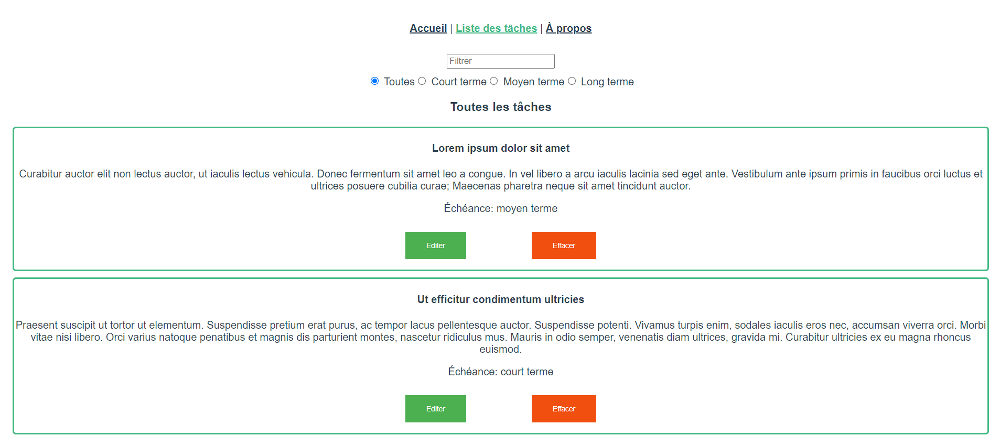

# Vue 3 composition API: Progressor

_September 2021_

> 🔨 CRUD using Vue3 and the new composition API. From Udemy [Vue 3 par la pratique - Samir Medjdoub / Code Concept](https://www.udemy.com/course/vue-3-par-la-pratique).

---

Demo on [Github page]().

<h1 align="center">
    
</h1>

<h2 align="center">
    
</h2>

## Composition API vs Options API

One of the big features that the Vue 3 release brings is the Composition API. In Vue 2, components were built using the Options API. The CodeSandbox below shows a very simple component using the Options API.

### Component with Options API

In Vue 3, in addition to the Options API, you now have the option to use the Composition API. Below is an example of the exact same component, but using the Composition API instead.

```vue
<template>
  <div id="app">
    <p>You clicked {{ numOfClicks }} times.</p>
    <button @click="handleClick()">Click me to increment!</button>
  </div>
</template>

<script>
export default {
  name: "App",
  data() {
    return {
      numOfClicks: 0,
    };
  },
  created() {},
  methods: {
    handleClick: function () {
      this.numOfClicks++;
    },
  },
};
</script>

<style>
#app {
  font-family: "Avenir", Helvetica, Arial, sans-serif;
  -webkit-font-smoothing: antialiased;
  -moz-osx-font-smoothing: grayscale;
  text-align: center;
  color: #2c3e50;
  margin-top: 60px;
}
</style>
```

### Component with Composition API

```vue
<template>
  <div id="app">
    <p>You clicked {{ numOfClicks }} times.</p>
    <button @click="handleClick()">Click me to increment!</button>
  </div>
</template>

<script>
import { ref } from "vue";

export default {
  name: "App",
  setup() {
    let numOfClicks = ref(0);

    function handleClick() {
      numOfClicks.value++;
    }

    return {
      handleClick,
      numOfClicks,
    };
  },
};
</script>

<style>
#app {
  font-family: "Avenir", Helvetica, Arial, sans-serif;
  -webkit-font-smoothing: antialiased;
  -moz-osx-font-smoothing: grayscale;
  text-align: center;
  color: #2c3e50;
  margin-top: 60px;
}
</style>
```

You'll notice the big difference here is the setup function. This is a new component option that holds all of the logic for the component. Instead of defining data, methods, and lifecycle hooks as separate component options, all of these now lie in the setup function.

Another important difference is that you no longer have to use this to access your data in methods.

[Source](https://auth0.com/blog/vue-composition-api-tutorial/)

## Useful links

- [codeconcept/progressor-compo-api](https://github.com/codeconcept/progressor-compo-api)
- [Vue 3 Composition API - "ref" and "reactive"](https://www.thisdot.co/blog/vue-3-composition-api-ref-and-reactive)
- [Introducing the Vue Composition API with a practical example](https://www.zweitag.de/blog/vue-composition-api-introduction/)
- [Vue 3 Composition API, do you really need it?](https://labs.thisdot.co/blog/vue-3-composition-api-do-you-really-need-it)
- [Communicating between Vue components: smart vs dumb](https://buddy.works/tutorials/communicating-between-vue-components)
- [Explaining the Vue Context Argument – A Composition API Tutorial](https://learnvue.co/2021/06/explaining-the-vue-context-argument-a-composition-api-tutorial/)
- [Computed Properties and Watchers](https://vuejs.org/v2/guide/computed.html)
- [How To Deploy Your Vue App to Github Pages](https://learnvue.co/2020/09/how-to-deploy-your-vue-app-to-github-pages/)
