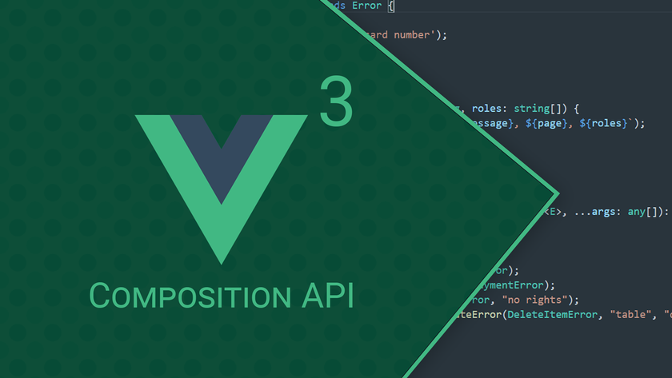

# Vue 3 composition API

_September 2021_

> 🔨 From Udemy [Vue 3 par la pratique - Samir Medjdoub / Code Concept](https://www.udemy.com/course/creez-des-animations-avec-lhtml-canvas).

---

<h1 align="center">
    
</h1>

## Useful links

- [codeconcept/progressor-compo-api](https://github.com/codeconcept/progressor-compo-api)
- [Vue 3 Composition API - "ref" and "reactive"](https://www.thisdot.co/blog/vue-3-composition-api-ref-and-reactive)
- [Introducing the Vue Composition API with a practical example](https://www.zweitag.de/blog/vue-composition-api-introduction/)
- [Communicating between Vue components: smart vs dumb](https://buddy.works/tutorials/communicating-between-vue-components)
- [Explaining the Vue Context Argument – A Composition API Tutorial](https://learnvue.co/2021/06/explaining-the-vue-context-argument-a-composition-api-tutorial/)
- [Computed Properties and Watchers](https://vuejs.org/v2/guide/computed.html)
